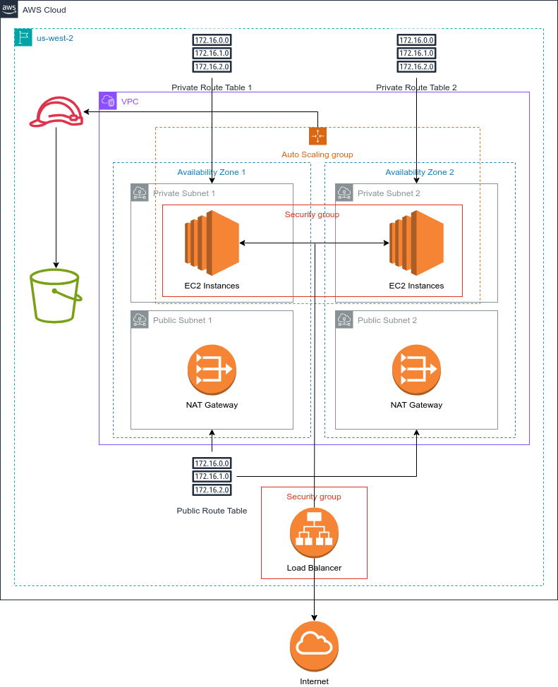

# CD12352 - Infrastructure as Code Project Solution

This project spins up a high-availability web server on AWS using AWS CloudFormation templates.

The infrastructure is as follows:



## Spin up instructions

Step 1. Configure AWS (preferably adding a new profile for udacity)

```
aws configure --profile udacity
```

Step 2. Create network infrastructure

```
./create_network.sh --profile udacity
```

Step 3. Create key pair (so you may connect to the server via ssh)

```
./create_keypair --profile udacity
```

It will create a key pair named "MyKeyPair" by default, or you may pass in a parameter "name" to change it.

If you get permission error, do this manually via AWS console.

Step 4. Create server infrastructure

If you've used other than the default keypair name, update the KeyPair parameter in `udagram-parameters.json` file. Otherwise, run this command:

```
./create_udagram.sh --profile udacity
```


Once completed running, you may go to the **Outputs** tab and get the path to the public page.

You should then see this beautiful page:


## Tear down instructions

For now, you'll have to delete the CloudFormation templates manually from the AWS console.

## Other considerations

I have several files in the `/cf_templates` directory:

- `network.yml`: The network infrastructure
- `network-parameters.json`: The parameters for the network infrastructure
- `udagram.yml`: The template used by the `create_udagram.sh` and `update_udagram.sh` scripts
- `udagram-parameters.json`: The parameters for the application infrastructure
- `s3.yml`: Unused - Only the S3 bucket creation template
- `udagram-basic-from-solution.yml`: A basic Udagram app template without S3 using the template code from one of the earlier exercises
- `udagram-no-autoscaling.yml`: Also another basica app template without Autoscaling and LoadBalancer
- `udagram-with-bastion.yml`: Udagram app with a bastion server for SSH connection instead of SSM (connecting via Bastion server )
- `udagram-with-ssm.yml`: The default template - allows you to connect to the server via Amazon Session Manager (SSM)

To pick an application template, simply copy the content from any of the `udagram-*.yml` files into the `udagram.yml` template, and then run the `create_udagram.sh` script as instructed above.

### How to connect to the server

To connect to the server, you can do so via Amazon Session Manager (SSM)

First, get the EC2 instance ID from the EC2 console:


Then use it to connect as follows:

```
aws ssm start-session --target i-0a37633585c04f087 --profile udacity
```

**Note: The following method does not work via the Udacity workspace, you need to do this on your own computer.**

For better bash features, you can do this via SSH, but you'll first need to change the behavior of the SSM CLI a bit. First, run the `ssm_via_ssh.sh` script:

```
./ssm_via_ssh.sh
```

And then, add the keypair into your ssh list (this is the part that isn't allowed within the Udacity Workspace) - don't forget to change the permission so you won't get a "Permission too open" error:

```
chmod 600 MyKeyPair.pem
ssh-add MyKeyPair.pem
```

Once completed you may connect like so:

```
ssh -i ./MyKeyPair.pem ubuntu@i-0a37633585c04f087
```